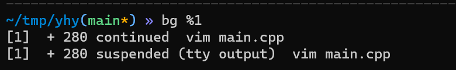

#### 1 确定任务目标

本实验已经给定了一个tiny-shell的骨架，现要完成里面核心的7个功能组件，以便完善shell的功能；

##### 1.1 确定函数功能目标

> eval()：解析和解释命令行的主要例程；
>
> builtin_cmd()：识别并解释内置的命令，包括：quit, fg, bg, jobs;
>
> do_bgfg()：实现bg和fg的指令；
>
> waitfg()：等待一个前台工作的完成；
>
> sigchld_handler()：捕获SIGCHILD信号；
>
> sigint_handler()：捕获SIGINT信号；[ctrl + C]
>
> sigtstp_handler()：捕获SIGTSTP信号；[ctrl + Z]

  

##### 1.2 Basic Unix Operation

**1. 在指令末尾 + &：代表将指令丢到后台bg中，此时bash会给予这个指令一个job number**

 

**2. ctrl + Z：将当前前台fg的工作丢到后台bg中暂停**（在vim的界面中ctrl+Z）


**3. jobs：观察目前后台bg下的所有工作状态** 


**4.  fg/bg：将后台工作拿到前台/前台处理**

```c
fg + %job_number : 当前界面切入vim程序（上例）
bg + %job_number : 将vim程序放入后台处理（上例）
```



**5. 显示所有允许着的进程**

静态：ps aux

动态：top

​    

##### 1.3 **General Overview of Unix Shells**

规定1：命令行第一个字要么是内置命令的名称，要么是可执行文件的路径名；

规定2：如果是内置命令，立即执行，否则将其视为可执行文件的路径名；

规定3：运行可执行文件时，shell分叉一个子进程，然后在子进程的上下文中加载并运行该程序

​			 通过解释单个命令行而创建的子进程统称为作业；

规定4：一个作业可以由由Unix管道连接的多个子进程组成；以&结尾的，放入后台；

规定5：在任何时间点，最多可以在前景中运行一个作业。但是，任意数量的作业可以在后台运行；

规定6：键入ctrl-c会导致将SIGINT信号传递到前景作业中的每个过程中；终止进程

规定7：输入ctrl-z会将sigtstp信号传递到前景作业中的每个进程；暂停进程

​			当且仅当被SIGCONT信号唤醒

```c
tsh > jobs 			//这是运行内置命令：builtin cmd
tsh > /bin/ls		//运行的是程序
 
/*
jobs: List the running and stopped background jobs；

bg <job>: Change a stopped background job to a running background job； 
fg <job>: Change a stopped or running background job to a running in the 						foreground；
kill <job>: Terminate a job
```

  

##### 1.4  Specification实验要求

1、用户输入的命令行应该由一个名称和零个或多个参数组成，全部由一个或多个空格分隔。如果名称是一个内置的命令，那么tsh应该立即处理它，并等待下一个命令行。否则，tsh应该假设名称是可执行文件的路径，它在初始子进程的上下文中加载并运行（在此上下文中，术语作业指的是这个初始子进程）；

2、Tinyshell不需要支持管道（|）或I/O重定向（<和>）。

3、每个作业都可以通过进程ID(PID)或 job ID(JID)来标识，这是由tsh分配的正整数。jid应该在命令行上用前缀“%”表示。例如，“%5”表示JID5，而“5”表示PID5。（我们已经为您提供了操作作业列表所需的所有例程。

4、**builtin_cmd函数需要实现的功能如下：**

**–** The **quit** command terminates the shell.

**–** The **jobs** command lists all background jobs.

**–** The **bg <job>** command restarts <job> by sending it a SIGCONT signal, and then runs it in

the background. The <job> argument can be either a PID or a JID.

**–** The **fg <job>** command restarts <job> by sending it a SIGCONT signal, and then runs it in

the foreground. The <job> argument can be either a PID or a JID


测试程序的正确性：

```c
make test01		//编译运行自己的
make rtest01	//编译运行reference的；最后
```

关于jobs，fg，bg的输出格式：

```c
struct job_t {              /* The job struct */
    pid_t pid;              /* job PID */
    int jid;                /* job ID [1, 2, ...] */
    int state;              /* UNDEF, BG, FG, or ST */
    char cmdline[MAXLINE];  /* command line */
};
struct job_t *getjobpid(struct job_t *jobs, pid_t pid);
struct job_t *getjobjid(struct job_t *jobs, int jid); 

//返回的是job_t指针，解引用得到对象，用state控制前后台位置即可！
    
/* 确认格式：
jobs：//List the running and stopped background jobs
	[job_id] (pid) Running <argv整段命令>
	[job_id] (pid) Stopped <argv整段命令>
	空				//空，代表没有任何job
	
bg %num:
	bg command requires PID or %jobid argument		//只有bg一个命令
	bg: argument must be a PID or %jobid			//argv[1]不是数字或者%数字
	(pid): No such process
	%jobid: No such job
	[job_id] (pid) <argv>
	空
	
fg %num:
	fg command requires PID or %jobid argument;
	fg: argument must be a PID or %jobid
    (pid): No such process
	%jobid: No such job
	空
```

关于sscanf()函数：

```cpp
//sscanf()函数用于从字符串中读取指定格式的数据，其原型如下：
int sscanf (char *str, char * format [, argument, ...]);

//返回值
//成功则返回参数数目argc，失败则返回-1，错误原因存于errno 中。

//用法
int num;
char lowercase[100];
sscanf(str,"%d %[a-z]", &num, lowercase);
//同理，带有%num
sscanf(str,"%%%d", &num);
```

关于kill()传递信号函数：

> 函数说明：kill(pid, sig_num)可以用来送参数sig 指定的信号给参数pid 指定的进程。参数pid 有几种情况：
>
> 1、pid>0 将信号传给**进程**识别码为pid 的进程.
>
> 2、pid=0 将信号传给和目前进程相同进程组的所有进程
>
> 3、pid=-1 将信号广播传送给系统内所有的进程
>
> 4、**pid<0** 将信号传给**进程组**识别码为pid 绝对值的**所有进程参数** sig 代表的信号编号可参考附录D


写一个快速测试所有样例的脚本：

单元测试: ./execute.sh 01~16

```bash
#! /bin/bash

mytest="test"
rtest="rtest"

make "$mytest$1" > my_ans.txt
make "$rtest$1" > correct_ans.txt
sed -i '1d' my_ans.txt			#删首行，无关的行
sed -i '1d' correct_ans.txt
echo "=======================test $1======================="
diff my_ans.txt correct_ans.txt > my_result.txt
if [[ ! -s "my_result.txt" ]]			#result是否为空
then
	echo "Success."
else
	cat my_result.txt
fi
```


所有样例一起跑	  ./execute.sh

```bash
#! /bin/bash

mytest="test"
rtest="rtest"
zero="0"

for((i=1;i<=16;i++))
do
	echo "=======================test $i======================="
	if [ "$i" -lt 10 ]
	then
		make "$mytest$zero$i" > my_ans.txt
		make "$rtest$zero$i" > correct_ans.txt		
	else
		make "$mytest$i" > my_ans.txt
		make "$rtest$i" > correct_ans.txt
	fi
	sed -i '1d' my_ans.txt			#删首行，无关的行
	sed -i '1d' correct_ans.txt
	diff my_ans.txt correct_ans.txt > my_result.txt
	if [[ ! -s "my_result.txt" ]]			#result是否为空
	then
		echo "Success."
	else
		cat my_result.txt
	fi
done
```


